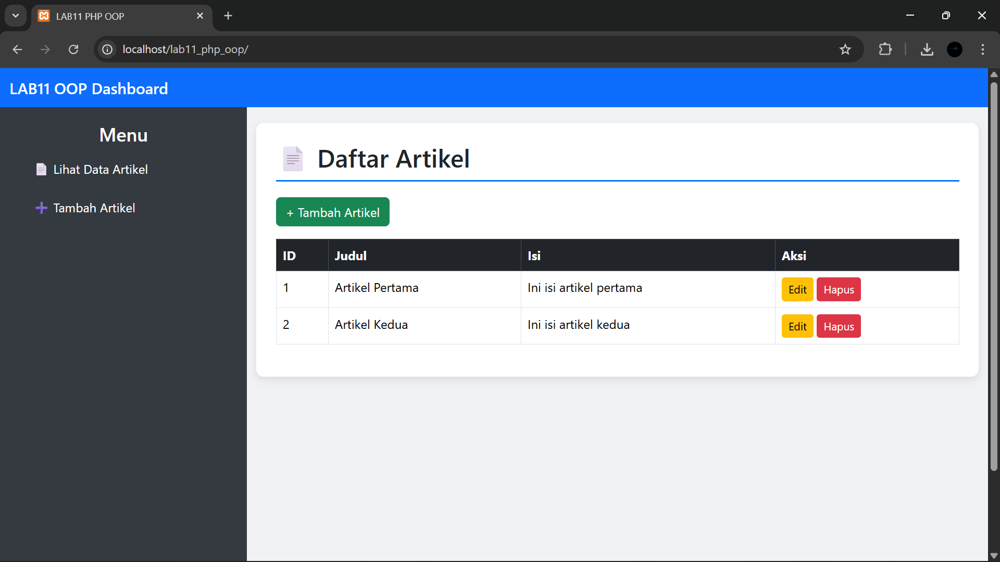
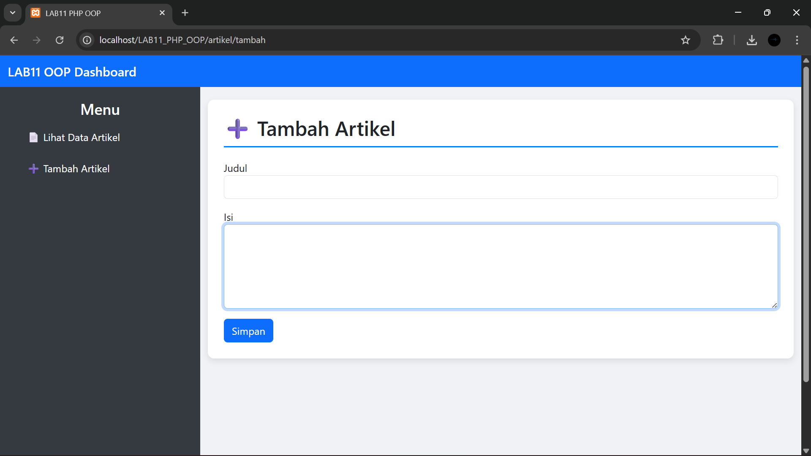
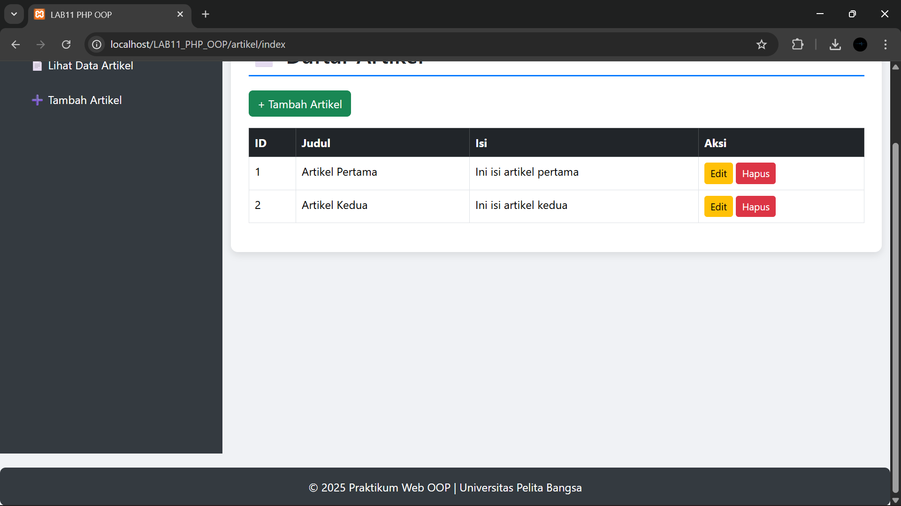
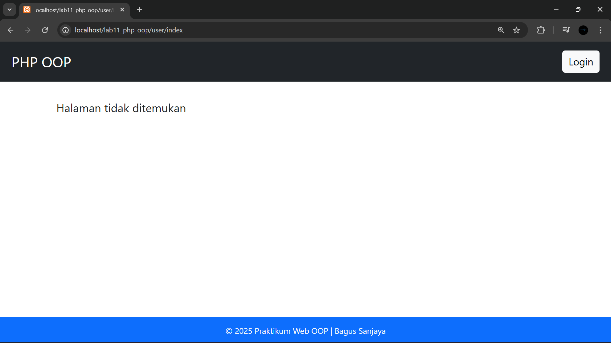
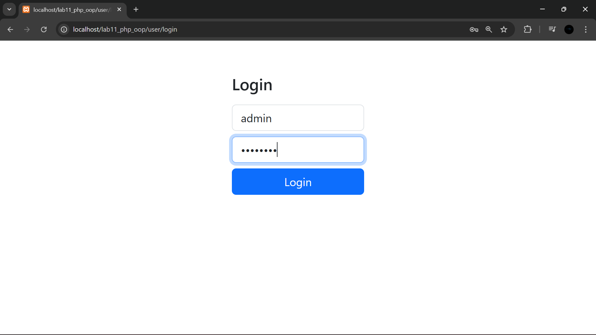
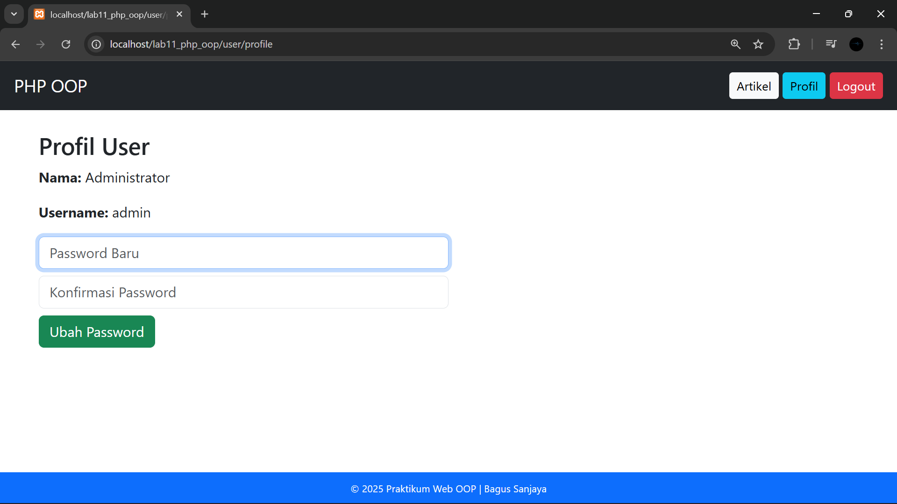
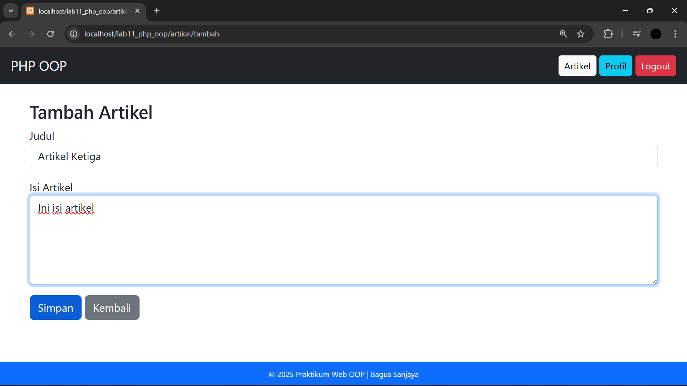
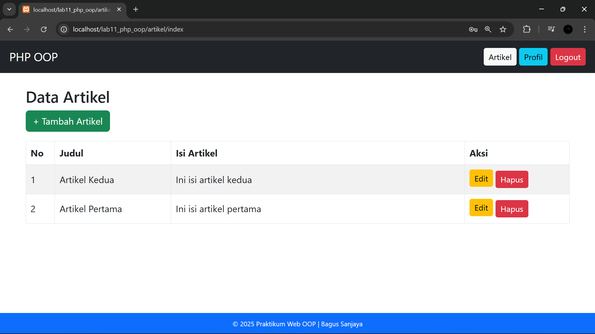

# Nama: Bagus Sanjaya

# Kelas: TI.24.A.5

# NIM: 312410505

# LAB11_PHP_OOP

Praktikum ini bertujuan untuk memahami **PHP OOP Lanjutan** dengan penerapan:
- Modularisasi
- Routing
- CRUD (Create, Read, Update, Delete)
- Template layout (header, sidebar, footer)
- Pemisahan CSS untuk styling

## Langkah Praktikum

### 1. Konfigurasi Database
- Buat database `latihan_oop`.
- Buat tabel `artikel`:
```sql
CREATE TABLE artikel (
  id INT AUTO_INCREMENT PRIMARY KEY,
  judul VARCHAR(100),
  isi TEXT
);
```
- Simpan pengaturan koneksi di `config.php`.

### 2. Routing dengan `.htaccess` dan `index.php`
- Tambahkan file `.htaccess` untuk URL rewrite.
- `index.php` membaca path dari `$_SERVER['PATH_INFO']` lalu memanggil file modul sesuai URL.
- Contoh:
  - `/artikel/index` → `module/artikel/index.php`
  - `/artikel/tambah` → `module/artikel/tambah.php`

### 3. Class `Database`
- Buat class `Database` di `class/database.php`.
- Method utama:
  - `query()` → menjalankan SQL.
  - `get()` → ambil data tunggal.
  - `insert()` → tambah data.
  - `update()` → ubah data.

Tujuannya agar query SQL lebih terstruktur dan reusable.

### 4. Template Layout
- `header.php` → Navbar + membuka layout.
- `sidebar.php` → Menu navigasi (Lihat Data, Tambah Data).
- `footer.php` → Tutup layout + footer.
- Semua modul dipanggil di dalam layout ini.


### 5. Styling dengan CSS
- Buat folder `assets/css/` berisi `style.css`.
- Atur tampilan sidebar, konten, dan footer agar lebih menarik.
- Pisahkan CSS dari PHP untuk maintainability.

### 6. CRUD Modul Artikel
#### a. Read (`index.php`)
- Menampilkan daftar artikel dalam tabel.
- Tombol **Edit** dan **Hapus** tersedia di setiap baris.

#### b. Create (`tambah.php`)
- Form input judul dan isi artikel.
- Data disimpan ke database dengan method `insert()`.

#### c. Update (`ubah.php`)
- Form edit dengan data lama sudah terisi.
- Data diupdate ke database dengan method `update()`.

#### d. Delete (`hapus.php`)
- Menghapus data artikel berdasarkan `id`.
- Redirect kembali ke daftar artikel.

## ✨ Hasil
- Sidebar kiri untuk navigasi.



- Konten kanan berganti sesuai modul CRUD.





- Footer tampil di bawah dengan identitas praktikum.



# Praktikum PHP OOP Modular (LAB11)

## Tujuan Praktikum
Praktikum ini bertujuan untuk:
- Menerapkan konsep **Object Oriented Programming (OOP)** pada PHP
- Mengimplementasikan **struktur modular**
- Membuat aplikasi web dinamis dengan fitur **CRUD**
- Mengelola autentikasi user menggunakan **Session**
- Membuat tampilan web yang **responsif** menggunakan Bootstrap


## Struktur Folder Project
Project disusun secara modular agar kode lebih terorganisir dan mudah dikembangkan.

```
LAB11_PHP_OOP/
│
├── class/
│   ├── database.php
│   └── form.php
│
├── module/
│   ├── artikel/
│   │   ├── index.php
│   │   ├── tambah.php
│   │   └── ubah.php
│   │
│   ├── home/
│   │   └── index.php
│   │
│   └── user/
│       ├── login.php
│       ├── logout.php
│       └── profile.php
│
├── template/
│   ├── header.php
│   └── footer.php
│
├── .htaccess
├── config.php
└── index.php
```


##  Konfigurasi Aplikasi

### `config.php`

Digunakan untuk:

* Menyimpan konfigurasi database
* Menentukan `base_url`
* Mengatur pengaturan global aplikasi


## Class Database

### `class/database.php`

Class ini digunakan untuk:

* Membuat koneksi database MySQL
* Menjalankan query SQL
* Mengambil data dari database

Konsep OOP diterapkan agar koneksi database dapat digunakan ulang di seluruh module.

## Class Form

### `class/form.php`

Digunakan untuk:

* Membantu pembuatan elemen form
* Menyeragamkan tampilan input
* Mengurangi penulisan kode HTML berulang


## Routing Aplikasi

Routing dilakukan melalui file utama:

### `index.php` (root)

File ini berfungsi sebagai:

* Router utama aplikasi
* Menentukan module dan aksi berdasarkan URL

Contoh URL:

```text
http://localhost/LAB11_PHP_OOP/artikel/index
http://localhost/LAB11_PHP_OOP/user/login
```


## Modul Home

### `module/home/index.php`

Merupakan halaman utama aplikasi setelah user login.

Fungsi:

* Menampilkan halaman dashboard sederhana
* Memberikan navigasi ke module lain



## Modul User

### Login

`module/user/login.php`
Digunakan untuk:

* Autentikasi user
* Validasi username dan password
* Menyimpan session login



### Profile

`module/user/profile.php`
Digunakan untuk:

* Menampilkan data user
* Mengubah password user



### Logout

`module/user/logout.php`
Digunakan untuk:

* Menghapus session
* Mengakhiri proses login

## Modul Artikel (CRUD)

### Create

`module/artikel/tambah.php`
Digunakan untuk menambahkan artikel baru ke database.



### Read

`module/artikel/index.php`
Digunakan untuk:

* Menampilkan daftar artikel
* Menampilkan judul dan isi artikel
* Menyediakan tombol Edit dan Hapus



### Update

`module/artikel/ubah.php`
Digunakan untuk mengubah data artikel berdasarkan ID.


### Delete

Proses hapus dilakukan langsung di:

```text
artikel/index?hapus=ID
```

## Template Header

### `template/header.php`

Digunakan untuk:

* Menampilkan navbar
* Memuat Bootstrap
* Menyimpan CSS global
* Menyesuaikan menu berdasarkan status login

## Template Footer

### `template/footer.php`

Footer dirancang dengan fitur:

* Posisi **fixed di bawah layar**
* Lebar penuh kiri–kanan
* Tetap terlihat walaupun halaman di-scroll
* Responsif untuk desktop dan mobile

## File .htaccess

Digunakan untuk:

* Mengaktifkan URL friendly
* Menghilangkan `.php` dari URL
* Mengarahkan request ke `index.php`


## Kesimpulan

Dengan praktikum ini, diperoleh pemahaman tentang:

* Penerapan OOP dalam PHP
* Struktur project modular
* Penggunaan routing sederhana
* Implementasi CRUD
* Penggunaan session untuk autentikasi
* Desain antarmuka responsif dengan Bootstrap
